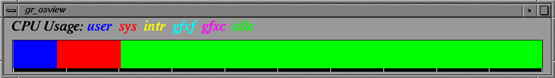
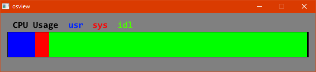
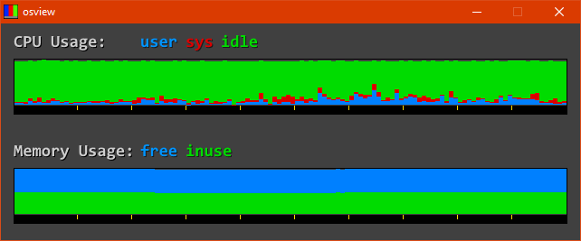

# osview

What is "osview"? Back in the days of Silicon Graphics's supremacy over
the performance computing market, their operating system, IRIX, featured
a graphical system monitoring tool called "gr_osview". A screenshot of this
tool is below:  

 

## Modern Alternative

Here are some screenshots of my tool as it stands:  

 

 
This program measures the amount of time the system has been executing tasks in kernel mode, user mode, and the amount of time that it has spent idling. By default it polls this information every 150ms. More information can be found in the Windows Dev Center; specifically, [here](https://docs.microsoft.com/en-us/windows/win32/api/processthreadsapi/nf-processthreadsapi-getsystemtimes). All the rendering is handled using the SDL2 library.

## Building

A precompiled binary is provided under the release section, but if you wish to build yourself:

#### Dependencies
* SDL2 (& SDL2 image)
* Win32
* make
* C++ compiler, default is gcc

The makefile does require you to configure the library and include directories for SDL2.
