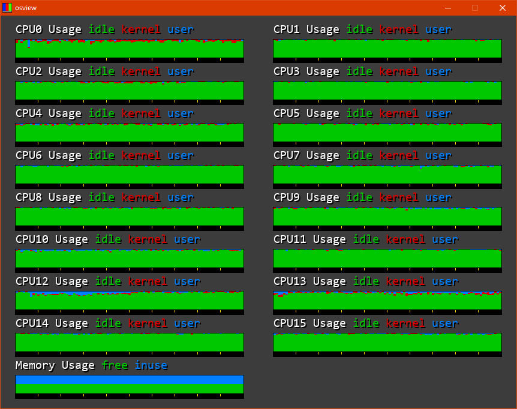
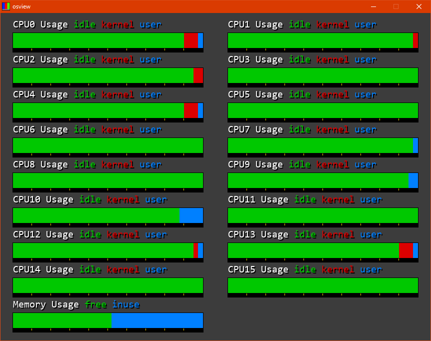

# osview

_osview_ is a graphical system resource monitoring tool featured in Silicon Graphics's IRIX operating system. A screenshot of this
tool is below:  

 

## Modern Alternative

This programs features support for multi-core systems along with memory reporting.

 

 
This program measures the amount of time the system has been executing tasks in kernel mode, user mode, and the amount of time that it has spent idling. The polling time is variable, by default it is set to a value that allows the vertical graph to display the previous 60 seconds of information. The data poller makes use of two Win32 API functions: [NtQuerySystemInformation](https://learn.microsoft.com/en-us/windows/win32/api/winternl/nf-winternl-ntquerysysteminformation) and [GlobalMemoryStatusEx](https://learn.microsoft.com/en-us/windows/win32/api/sysinfoapi/nf-sysinfoapi-globalmemorystatusex);

## Building

A precompiled binary is provided under the release section, but if you wish to build yourself:

#### Dependencies
* SDL2 (SDL2image and SDL2ttf)
* [NFont](https://github.com/grimfang4/nfont) by grimfang4
* [plog](https://github.com/SergiusTheBest/plog) by SergiusTheBest
* Win32
* make
* C++ compiler, default is g++

The makefile does require you to configure the library and include directories for SDL2.
