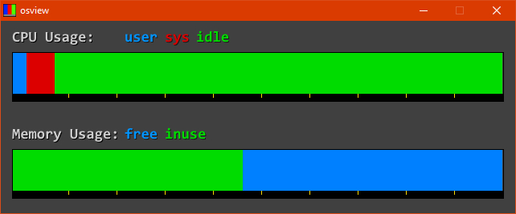
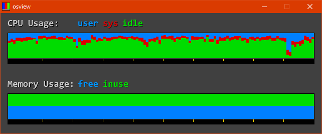

# osview

What is "osview"? Back in the days of Silicon Graphics's supremacy over
the performance computing market, their operating system, IRIX, featured
a graphical system monitoring tool called "gr_osview". A screenshot of this
tool is below:  

 

## Modern Alternative

Since the days of IRIX being usable in the PC market are long gone, I have
sought a way to recreate this program for years. Often I have come close, but
before recently I was not able to recreate the proper look and feel of this tool.
Here are some screenshots of my tool as it stands:  

 

 
This tool uses the win32 api library in order to measure system resource
usage time over a period defined in the main program. Specifically, it measures the amount of time the system has been executing tasks in kernel mode, user mode, and the amount of time that it has spent idling. More information can be found in the Windows Dev Center; specifically, [here](https://docs.microsoft.com/en-us/windows/win32/api/processthreadsapi/nf-processthreadsapi-getsystemtimes). All the rendering is handled using the SDL2 library.
Because this program uses the win32 api it is only compatible with Windows.

## Usage And Further Explanation

Because this tool retrieves its information directly from the Windows api it can be used as an accurate measure of system performance over a period
of time. The values shown will likely not line up with the values in Task Manager. This is due to how Task Manager records system performance: it
shows the amount of CPU cycles over a given period that were not spent idling. Task Manager also displays percent utilization while osview does not (the calculation is performed but it is not displayed to the user).
